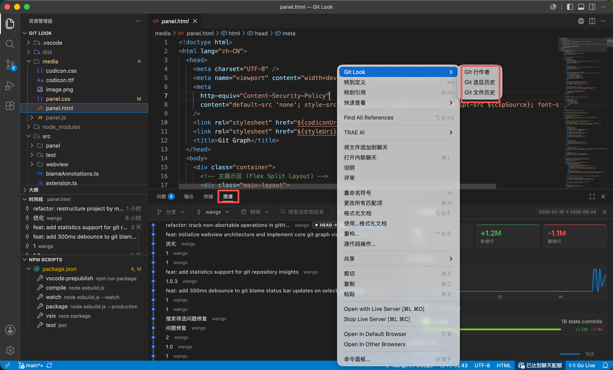

# Git Look - Git 可视化

一个专注于 Git 历史信息检索与溯源的 VS Code 插件。

[](https://marketplace.visualstudio.com/items?itemName=wangx123.git-visual)
[](https://github.com/wangx7/Git-Look/blob/main/LICENSE)
[](https://marketplace.visualstudio.com/items?itemName=wangx123.git-visual)

> **💡 Git 可视化核心理念：只检索查看，不更改工作区，让代码溯源与审查更纯粹、安全。**

---

## 🚀 核心功能

### 1. 📂 Git 交互式图谱 (Git Graph)

- **分支演进树**：提供清晰直观的全局分支合并与演进拓扑图。
- **多维检索**：支持按分支、作者、日期区间、提交哈希或 Message 关键字等进行多重组合筛选。
- **详尽详情面板**：点击提交记录即可查看详细元数据及受影响的文件列表，支持单键快速打开 Diff 视图查看文件变更。
- **数据统计**：集成了贡献度排行榜、每日提交活跃度趋势图（SVG 曲线）以及变更最频繁的 Top 文件分析。

### 2. ✍️ 像素级行内作者 (Inline Blame)

- **行内提示**：光标移动时，在当前行右侧以暗色优雅展现该行代码的最后提交者和提交时间。
- **智能联动**：当前行的 blame 信息会与状态栏、底部图表进行双向高亮或详情联动。
- **极速开关**：右键菜单中一键开启/关闭行内提示，保持编辑器洁净。

### 3. 🔍 选区历史溯源 (Selection History)

- **代码块追踪**：在编辑器中选中任意一行或多行代码，右键选择 `Git Look -> Git 选区历史`。
- **时序演进**：插件会自动定位并过滤出仅对该代码段产生过修改的提交时间轴，助您迅速锁定“最初创建者”或“关键修改引入者”。

### 4. 🗂️ 文件历史追溯 (File History)

- **全历史一览**：在当前打开的文件中右键选择 `Git Look -> Git 文件历史`，即可在右侧面板展示该文件的完整提交记录。
- **历史对比**：支持将任意历史版本的文件与当前本地文件进行 Side-by-Side 差异对比（Diff），清晰洞察代码演进细节。

---

## 🛠️ 使用指南

### 1. 唤起 Git 图谱

安装插件后，您的底栏（Panel 容器，即终端/输出所在区域）会自动新增一个名为 **“图谱”** 的标签页，点击即可打开 Git Graph 交互式面板。

### 2. 右键便捷菜单

在编辑器中点击右键，即可在上下文菜单的 **`Git Look`** 子菜单下找到所有快捷命令：

```
右键菜单 (Context Menu)
 └── 🔍 Git Look
      ├── 👤 Git 行作者 (切换行内 blame 提示)
      ├── 🕒 Git 选区历史 (追踪选中代码块的时序演进)
      └── 📄 Git 文件历史 (查看当前文件提交记录并对比 diff)
```

---

## 🎨 视觉效果预览



---

## ⚡ 性能与体验优化

- **轻量与响应式**：采用防抖文件监听机制（Debounced File Watcher）与 Git 结果缓存（Git Cache），即使在拥有数万条 Commit 的大型商业仓库中也能毫秒级加载。
- **无感适配**：完美适配 VS Code 官方 Dark/Light 各类主题色，采用精美现代的排版字体与顺滑的过渡动画。
- **纯粹只读**：插件绝不包含任何 `git commit`、`git push` 或可能产生代码冲突的写操作，保障日常开发绝对安全。

---

如果你觉得这款插件好用，欢迎在 [GitHub Repository](https://github.com/wangx7/Git-Look) 给我们点个 Star 🌟，或者在 Marketplace 中留下你的好评！
